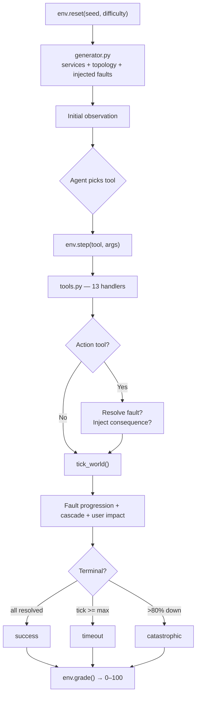

# IncidentRoom

**Tick-based SRE incident-response simulator powered by Google Gemini — built for the Google Hackathon.**

A deterministic, graded environment where AI agents diagnose and remediate infrastructure outages under a tick budget. Wrong actions don't just cost points — they **inject new faults**, making the incident actively worse.

[](https://python.org)
[](https://fastapi.tiangolo.com)
[](https://ai.google.dev)
[](https://cloud.google.com/run)
[](https://docker.com)

---

## Live Demo

- **Hugging Face Spaces:** https://huggingface.co/spaces/Pulkit0707/IncidentRoom

---

## Google Tech Stack

| Component | Technology | Purpose |
|-----------|-----------|---------|
| **LLM** | Gemini 2.5 Flash / Pro | Agent reasoning and tool-calling via Google AI Studio |
| **Deployment** | Google Cloud Run | Serverless container hosting (scales to zero, free tier) |
| **CI/CD** | Google Cloud Build | Automated build → Artifact Registry → Cloud Run pipeline |
| **Registry** | Google Artifact Registry | Docker image storage |
| **API** | Google AI Studio OpenAI-compatible endpoint | Drop-in integration, no SDK change required |

Gemini is the **default model** in the dashboard — open Settings and paste your [Google AI Studio](https://aistudio.google.com/apikey) key to run the agent immediately.

---

## What Makes IncidentRoom Different

| Feature | Other Benchmarks | IncidentRoom |
|---------|-----------------|-------------|
| Wrong actions | Subtract points | **Inject new faults** — cascading failures |
| Environment | Stochastic / LLM-judged | **Fully deterministic** — same seed = same episode |
| Grading | String matching / LLM judge | **Pure arithmetic** over final world state |
| Signal | Pass / fail | **Graded 0–100** with 4 independent components |

---

## Architecture



**Stack:**
- `server/env.py` — episode lifecycle (`reset` / `step` / `grade`)
- `server/world.py` — `World` and `Service` dataclasses, `tick_world()`
- `server/faults.py` — 6 primary faults + 2 consequence faults
- `server/generator.py` — procedural world generation (seeded RNG)
- `server/tools.py` — 13 tool handlers + OpenAI function-calling schemas
- `server/grader.py` — pure scoring function
- `webapp.py` — FastAPI: REST + SSE streaming, arena mode, run history
- `llm_agent.py` — async generators: standard / streaming / human-in-the-loop
- `static/index.html` — single-file dark dashboard (SSE, topology canvas, ELO leaderboard)
- `db.py` — SQLite persistence (runs, ELO ratings, custom scenarios)

---

## Scoring (100 pts)

```
  Fault Resolution  ████████████████████            40 pts
  Service Health    ████████████▌                   25 pts
  User Impact       ██████████                      20 pts
  Time Efficiency   ███████▌                        15 pts
```

| Component | Points | Formula |
|-----------|-------:|---------|
| Fault Resolution | 40 | `(resolved / total) × 40` |
| Service Health | 25 | `avg(health(svc)) × 25` |
| User Impact | 20 | `max(0, 1 − impact/max_impact) × 20` |
| Time Efficiency | 15 | `(1 − tick/max_ticks) × 15` — only if ALL faults resolved |

---

## Fault Types

| Fault | Targets | Correct Fix | Wrong Action Consequence |
|-------|---------|-------------|--------------------------|
| `MemoryLeakAfterDeploy` | api, worker, gateway | `rollback(target)` | `LatentDefect` on wrong rollback target |
| `CacheEvictionStorm` | cache | `restart_pod(cache)` or `scale_up(cache)` | `FlappingService` on restarted dependent |
| `ConfigDrift` | api, worker | `toggle_feature_flag(target, flag)` | Extra latency if rolled back instead |
| `DependencyTimeoutAmplification` | api | `enable_circuit_breaker(target)` | `scale_up` multiplies retry load |
| `DbPoolExhaustion` | database | `kill_long_queries(db)` or `scale_up(db)` | Restart kills in-flight connections |
| `CertExpiryBetweenServices` | api, gateway | `rotate_cert(svc_a, svc_b)` | Nothing else helps — pure tick waste |

---

## Tools (13 total)

**Read tools** (5) — each costs 1 tick:
`list_services` · `get_metrics` · `get_logs` · `get_topology` · `get_recent_changes`

**Action tools** (8) — each costs 1 tick + may trigger consequence:
`restart_pod` · `rollback` · `scale_up` · `toggle_feature_flag` · `enable_circuit_breaker` · `drain_region` · `kill_long_queries` · `rotate_cert`

Every tool call — even reads — advances the tick counter. Agents must be efficient.

---

## Benchmark Results

| Difficulty | Agent | Score | Outcome | Faults Fixed |
|------------|-------|------:|---------|-------------|
| Easy | **RuleBasedAgent** | **88.6** | success | 1/1 |
| Easy | NaiveAgent | 94.7 | success | 1/1 |
| Medium | **RuleBasedAgent** | **90.9** | success | 1/1 |
| Medium | NaiveAgent | 43.8 | timeout | 0/1 |
| Hard | **RuleBasedAgent** | **67.7** | timeout | 2/2 |
| Hard | NaiveAgent | 58.1 | timeout | 1/2 |

NaiveAgent restarts every unhealthy service — lucky on easy (cache fix), but restarting the wrong service on medium/hard injects consequence faults and cascades the outage.

---

## Quick Start

### Local (no API key needed)

```bash
pip install -r requirements.txt
python demo.py           # single easy episode, colored output
python demo.py --all     # easy / medium / hard
```

### Web Dashboard with Gemini

```bash
pip install -r requirements.txt
python webapp.py         # http://localhost:8000
```

1. Click **Settings** (gear icon)
2. Select **Google AI Studio** preset — base URL fills automatically
3. Paste your [Google AI Studio API key](https://aistudio.google.com/apikey)
4. Model is pre-set to `gemini-2.5-flash`
5. Hit **Run Agent**

### Docker

```bash
docker build -t incidentroom .
docker run -p 7860:7860 incidentroom
```

---

## Environment Variables

| Variable | Default | Description |
|----------|---------|-------------|
| `PORT` | `8000` local / `7860` Docker | Web dashboard port |
| `HF_TOKEN` | — | API key for `inference.py` (OpenEnv spec runner) |
| `MODEL_NAME` | `gemini-2.5-flash` | Model for `inference.py` |
| `API_BASE_URL` | Google AI Studio endpoint | OpenAI-compatible base URL for `inference.py` |

---

## Deploy to Google Cloud Run

### Prerequisites

- [Google Cloud SDK](https://cloud.google.com/sdk/docs/install) installed and authenticated
- A Google Cloud project with billing enabled (Cloud Run free tier covers hackathon traffic)

### One-time setup

```bash
PROJECT_ID=your-project-id
gcloud config set project $PROJECT_ID

# Enable APIs
gcloud services enable \
  cloudbuild.googleapis.com \
  run.googleapis.com \
  artifactregistry.googleapis.com

# Create Artifact Registry repo
gcloud artifacts repositories create incidentroom \
  --repository-format=docker \
  --location=us-central1

# Grant Cloud Build permission to deploy
PROJECT_NUMBER=$(gcloud projects describe $PROJECT_ID --format="value(projectNumber)")
gcloud projects add-iam-policy-binding $PROJECT_ID \
  --member="serviceAccount:${PROJECT_NUMBER}@cloudbuild.gserviceaccount.com" \
  --role="roles/run.admin"
gcloud projects add-iam-policy-binding $PROJECT_ID \
  --member="serviceAccount:${PROJECT_NUMBER}@cloudbuild.gserviceaccount.com" \
  --role="roles/iam.serviceAccountUser"
```

### Deploy

```bash
gcloud builds submit --config cloudbuild.yaml
```

Cloud Build will: build the Docker image → push to Artifact Registry → deploy to Cloud Run. The app will be live at a `*.run.app` URL with a free SSL certificate.

**Cost:** Cloud Run free tier includes 2 million requests/month and 360k GB-seconds of memory. A hackathon demo runs for $0.

---

## Project Structure

```
cloudbuild.yaml         Cloud Build → Artifact Registry → Cloud Run pipeline
Dockerfile              Container build (python:3.11-slim, port 7860)
openenv.yaml            OpenEnv spec: tasks, action/observation space, scoring
inference.py            OpenEnv-compliant agent runner ([START]/[STEP]/[END])
demo.py                 Local rule-based agent demo with colored output
webapp.py               FastAPI server: REST + SSE streaming, arena mode
llm_agent.py            Async generators: standard / streaming / human-in-the-loop
db.py                   SQLite persistence (runs, ELO ratings, scenarios)
cost.py                 Per-model token pricing (Gemini, OpenAI, Anthropic)
scenarios.py            YAML custom scenario parser

server/
  env.py                IncidentRoomEnv: reset() / step() / grade()
  world.py              World & Service dataclasses, health(), tick_world()
  faults.py             6 primary faults + 2 consequence faults
  generator.py          Procedural world generation (seeded RNG, difficulty configs)
  tools.py              13 tool handlers + TOOL_SCHEMAS (OpenAI function-calling format)
  grader.py             Pure scoring function over final World state

static/index.html       Single-file dashboard (dark theme, SSE, topology canvas, ELO)
tests/                  pytest suite — determinism, env lifecycle, faults, grading, tools
```
