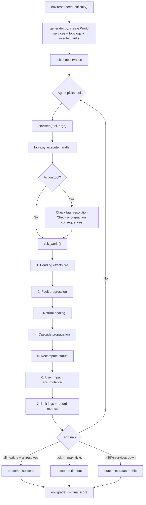

# IncidentRoom v2

**A tick-based SRE incident-response simulator where wrong actions make the world worse.**

IncidentRoom drops an AI agent into a procedurally generated infrastructure outage and gives it a limited budget of tool calls to diagnose and fix the problem. Unlike typical benchmarks that subtract points for mistakes, IncidentRoom _injects new faults_ when the agent takes the wrong action, creating cascading failures that make the episode actively harder. This teaches stateful decision-making under pressure -- a learning signal that does not exist anywhere else.

Built for the **Meta OpenEnv hackathon**.

## Key Differentiators

- **Fully deterministic** -- no LLM in the environment. Same `(seed, difficulty)` always produces the identical episode.
- **Wrong actions make the world worse** -- not just a score penalty. Rolling back the wrong service plants a latent defect. Restarting a cache dependent causes it to flap. Scaling up a retry-storming service multiplies the load.
- **Pure function grading** -- no string matching, no synonym handling, no LLM judge. The score is arithmetic over the final `World` state.
- **13 tools, 6 fault types, cascading failures** -- services have metrics that drift, dependencies that cascade, and faults that progress every tick the agent hesitates.

## Benchmark Results

Two built-in baseline agents on deterministic seeds (`demo.py --all`):

| Difficulty | Agent | Score | Outcome | Faults |
|------------|-------|------:|---------|--------|
| Easy | **RuleBasedAgent** | **88.6** | success | 1/1 |
| Easy | NaiveAgent | 94.7 | success | 1/1 |
| Medium | **RuleBasedAgent** | **90.9** | success | 1/1 |
| Medium | NaiveAgent | 43.8 | timeout | 0/1 |
| Hard | **RuleBasedAgent** | **67.7** | timeout | 2/2 |
| Hard | NaiveAgent | 58.1 | timeout | 1/2 |

**RuleBasedAgent** uses a 4-phase strategy (recon, investigate, diagnose, remediate) and matches fault signatures to correct tools. **NaiveAgent** restarts every unhealthy service -- it gets lucky on easy (cache eviction is fixed by restart) but fails on medium/hard where restarts are the wrong action and inject consequence faults.

The hard scenario resolves all faults but runs out of ticks before services fully heal, losing the 15-point efficiency bonus and accumulating user impact. The gap between agents widens with difficulty -- exactly the kind of signal IncidentRoom is designed to produce.

## Architecture



## Scoring Breakdown (100 pts)

```
  Fault Resolution   [████████████████████                    ]  40 pts
  Service Health     [████████████▌                           ]  25 pts
  User Impact        [██████████                              ]  20 pts
  Time Efficiency    [███████▌                                ]  15 pts
```

| Component | Points | Formula |
|-----------|-------:|---------|
| Fault Resolution | 40 | `(resolved / total) * 40` |
| Service Health | 25 | `avg(health(svc)) * 25` |
| User Impact | 20 | `max(0, 1 - impact/max_impact) * 20` |
| Time Efficiency | 15 | `(1 - tick/max_ticks) * 15` -- only awarded if ALL faults resolved |

## Quickstart

```bash
# Install
pip install -r requirements.txt

# Local demo (no API key needed)
python demo.py              # single easy episode
python demo.py --all        # easy / medium / hard

# Web dashboard
python webapp.py            # http://localhost:8000

# LLM inference (OpenEnv spec format)
export HF_TOKEN="your-key"
export MODEL_NAME="gpt-4.1-mini"
export API_BASE_URL="https://api.openai.com/v1"
python inference.py

# Docker (HF Spaces compatible)
docker build -t incidentroom .
docker run -p 7860:7860 incidentroom
```

## Environment Variables

| Variable | Default | Description |
|----------|---------|-------------|
| `HF_TOKEN` | *(required for inference)* | API key passed to the model provider |
| `MODEL_NAME` | `gpt-4.1-mini` | Model identifier for the LLM agent |
| `API_BASE_URL` | `https://api.openai.com/v1` | OpenAI-compatible chat completions endpoint |
| `PORT` | `8000` (local) / `7860` (Docker) | Port for the web dashboard |

## Project Structure

```
openenv.yaml            OpenEnv spec: tasks, action/observation space, scoring config
Dockerfile              Container build (python:3.11-slim, port 7860 for HF Spaces)
inference.py            OpenEnv-compliant agent: [START]/[STEP]/[END] stdout
demo.py                 Local rule-based agent demo with colored output
webapp.py               FastAPI server: REST + SSE streaming, arena mode
llm_agent.py            3 async generator modes: standard, streaming, HITL
db.py                   SQLite persistence (runs, elo_ratings, scenarios)
cost.py                 Per-model token pricing and cost calculation
scenarios.py            YAML custom scenario parser

server/
  env.py                IncidentRoomEnv: reset() / step() / grade()
  world.py              World & Service dataclasses, health(), tick_world()
  faults.py             6 primary faults + 2 consequence faults
  generator.py          Procedural world generation (seeded RNG, difficulty configs)
  tools.py              13 tool handlers + TOOL_SCHEMAS (OpenAI function-calling format)
  grader.py             Pure scoring function over final World state

static/index.html       Single-file frontend (dark theme, SSE, topology canvas)
```

## Fault Types

| Fault | Targets | Fix | Wrong Action Creates |
|-------|---------|-----|----------------------|
| MemoryLeakAfterDeploy | api, worker, gateway | `rollback(target)` | LatentDefect on wrong rollback target |
| CacheEvictionStorm | cache | `restart_pod(cache)` or `scale_up(cache)` | ServiceFlap on restarted dependent |
| ConfigDrift | api, worker | `toggle_feature_flag(target, flag)` | Adds latency if rolled back instead |
| DependencyTimeoutAmplification | api | `enable_circuit_breaker(target)` | `scale_up` multiplies retry load |
| DbPoolExhaustion | database | `kill_long_queries(db)` or `scale_up(db)` | Restarting a DB client kills in-flight connections |
| CertExpiryBetweenServices | api, gateway | `rotate_cert(svc_a, svc_b)` | Nothing else helps -- wastes ticks |

## Tools

**Read (5):** `list_services`, `get_metrics`, `get_logs`, `get_topology`, `get_recent_changes`

**Action (8):** `restart_pod`, `rollback`, `scale_up`, `toggle_feature_flag`, `enable_circuit_breaker`, `drain_region`, `kill_long_queries`, `rotate_cert`

Every tool call -- including reads -- costs one tick.
